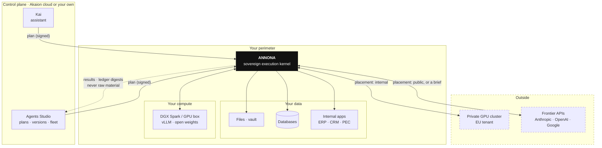
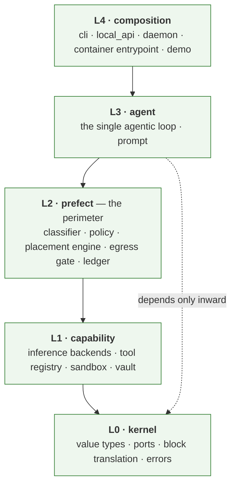
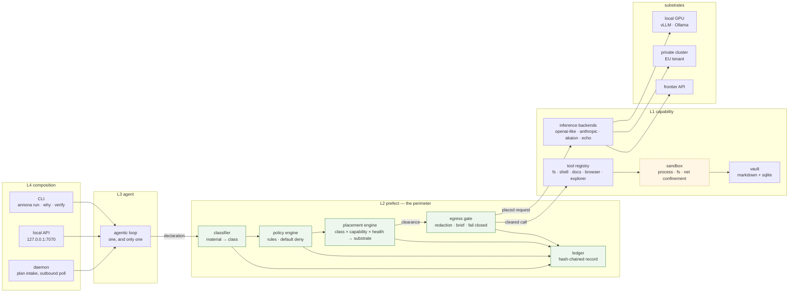
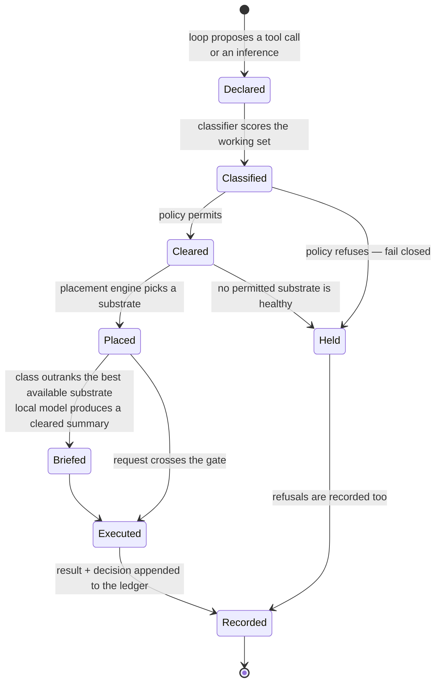
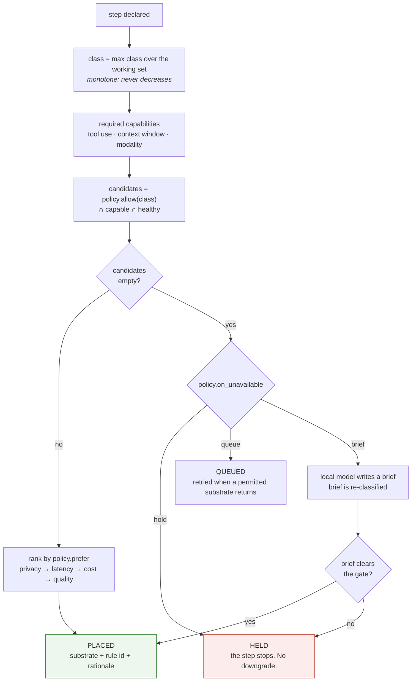
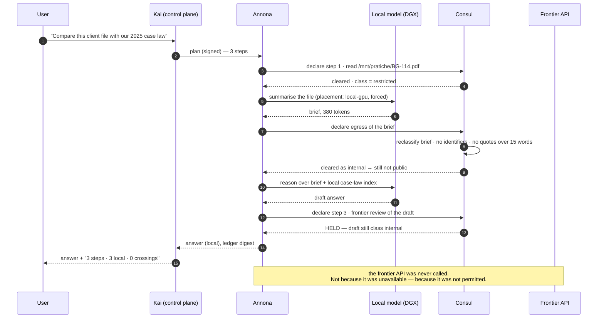
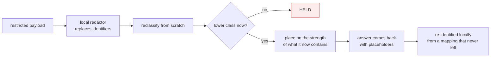
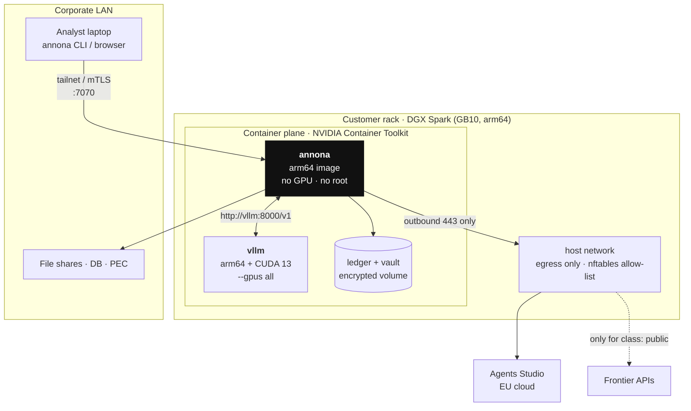
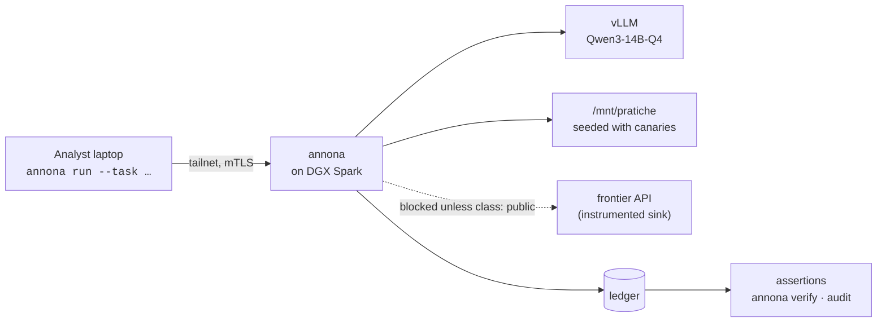

# High-level design

**Annona — the sovereign execution kernel for AI agents.**

- **Status:** design of record, and as of Phase F0–F3 also a description of the
  code. Sections marked *planned* are the ones that do not exist yet, and each
  says which phase it belongs to; §11 is the honest list.
- **Audience:** engineers who will implement it, and the security or compliance
  reviewer who has to believe it.
- **Companion documents:** [Architecture as built](architecture.md) describes
  only the code that exists. [Sovereign runtime](sovereign-runtime.md) holds the
  threat model in full. [Research](../research/index.md) states what we are
  trying to *prove*, with metrics.

---

## 1. The problem

An organisation adopting agentic AI picks one of three architectures, and each
one is a trap in a different direction.

| | **On-prem (DGX-class)** | **Private cloud + frontier API** | **Private cloud + own weights** |
|---|---|---|---|
| Where the model runs | in the building | OpenAI / Anthropic / Google | your GPU cluster |
| Where the data ends up | in the building | at the model provider | your tenant |
| Privacy | highest | contractual | high |
| Scalability | capped by the hardware | effectively infinite | high |
| Cost shape | CapEx, then ~zero per token | per token, unbounded | GPU-hours + MLOps |
| Model quality | open weights only | frontier | open weights, tuned |
| Compliance (GDPR / NIS2 / AI Act) | excellent | depends on the provider | good |
| Disaster recovery | you build it | included | you build it |

The industry argues about which column wins. That argument is the mistake: **the
right column is a property of the request, not of the company.** Summarising a
public tender is a different problem from reasoning over a client's medical file,
and the second one does not become safe because procurement signed a DPA.

So the unit of decision has to be the *step*, and something has to take that
decision consistently, ten thousand times a day, and be able to prove afterwards
what it decided. That something is missing from the stack. Annona is that
component.

### What already exists, and why it is not this

| Layer | Examples | What it decides | What it cannot do |
|---|---|---|---|
| Serving runtime | vLLM, Ollama, TensorRT-LLM, llama.cpp | how fast one model answers on one box | nothing about *which* box, and nothing about tools |
| AI gateway | LiteLLM, Portkey, Envoy AI Gateway, APISIX AI | which endpoint a token stream goes to | never executes a tool, never sees a file, no data classification, no proof |
| Agent framework | datapizza-ai, LangGraph, CrewAI | how you *write* an agent | placement is a config line the developer picks once |
| Sovereign models | Minerva, Velvet, Italia | *which* weights you may run in Europe | where any given request actually goes |

Every one of these is a legitimate component and Annona uses several of them.
None of them owns the sentence *"this step must run on that machine, and here is
the record that it did."*

> **The claim, stated so it can be falsified.** Annona is the first open-source
> project in which the **placement of every inference and every tool call is a
> policy decision, enforced by the runtime and verifiable after the fact**. If a
> project that does this appears, this sentence is wrong and we will say so here.

---

## 2. What Annona is

A daemon you install where the data already lives — a laptop, a server in the
rack, a DGX Spark, a VM in your own tenant. It receives a plan, and for every
step of that plan it:

1. **classifies** the material the step would touch,
2. **decides where the step may run** — local GPU, private cluster, frontier API,
3. **executes** it there, with tool calls sandboxed and checked,
4. **records** the decision in a hash-chained ledger you can verify yourself.

Annona is deliberately *not* the thing that decides what to do. Planning, memory
and orchestration stay in the control plane — Kai and Agents Studio for Akaion
customers, or your own software; the interface is three HTTP endpoints. This
split is the whole trust argument: the component that touches your data is the
one you can read, and it is small enough to read.

**Not goals.** Annona is not a model, not a serving runtime, not an agent
framework, not a vector database, and not a replacement for your identity
provider. It orchestrates all five and owns none of them.

---

## 3. Where it sits



Three properties of that picture are load-bearing:

- **Outbound only.** Annona opens no port to the internet. It polls the control
  plane and dials substrates. There is no inbound firewall rule to request from a
  customer's IT department — historically the step where sovereign deployments
  die.
- **The control plane never receives raw material.** It gets results the policy
  cleared, and ledger digests. If it were compromised it would learn what was
  decided, not what was read.
- **Every arrow leaving the walls is a placement decision**, taken per step, and
  written down.

---

## 4. Principles

These are the rules the design is checked against. Where the code does not yet
satisfy one, it is listed in [§11](#11-what-is-not-built-yet).

1. **Placement is policy, not configuration.** A developer cannot choose a
   provider in code. They declare intent; the kernel decides placement.
2. **Fail closed.** No candidate substrate is permitted → the step is **held**.
   An unclassifiable artefact is treated as the most restrictive class.
3. **Failover may degrade latency, cost or model quality. Never jurisdiction.**
   The single sentence that separates this from every gateway with a fallback
   list.
4. **Contamination is monotone.** A transcript that has touched restricted
   material stays restricted. Classes never go down on their own; only a cleared
   **brief** crosses down.
5. **The transcript is the leak.** Tool calls running locally is not the same as
   data staying local: a tool result joins the transcript and the transcript goes
   wherever the *next* inference goes. Placement is decided per step, over the
   whole working set, never once per session.
6. **One binary, one release.** Laptop, server and appliance differ in
   configuration, never in code. A fork per deployment is how sovereignty claims
   rot.
7. **Everything is recorded, and the record is checkable by the customer**, with
   a command that does not phone home.
8. **The kernel knows no vendors.** Enforced in CI, not asserted in prose — see
   [§5.1](#51-layers).

---

## 5. Architecture

### 5.1 Layers



All five layers are built and under test. L2 is `runner/policy` (classification,
rules, the default-deny gate), `runner/placement` (substrate health, the
placement engine, the routing backend) and `runner/audit` (the ledger), wired
per run by `runner/services/enforcement.py`.

The layering is enforced by `lint-imports` on every build — five contracts in
`.importlinter`, two of which assert that **neither the kernel nor the agent loop
can import a provider SDK**:

```
$ make contracts
L0 kernel does not depend on outer layers                    KEPT
L3 agent depends only inward on L0                           KEPT
L3 agent and L1 capability do not know about each other      KEPT
L0 kernel imports no provider SDK                            KEPT
L3 agent loop imports no provider SDK                        KEPT
```

"Provider-agnostic" is therefore a fact that fails the build when broken, not an
intention. Phase 1 adds a sixth: *L1 capability cannot reach the network except
through a substrate registered with the prefect.*

### 5.2 Components



| Component | Responsibility | One thing it must never do |
|---|---|---|
| **agentic loop** | turn a plan into steps; call tools; assemble answers | know which provider or machine it is talking to |
| **classifier** | assign a class to every artefact entering the working set | fail open on something it cannot classify |
| **policy engine** | evaluate rules; produce allow/deny + candidate set | be reachable from L1 (the enforced direction is inward) |
| **placement engine** | pick a substrate from the candidate set, or hold | prefer a cheaper substrate outside the permitted set |
| **egress gate** | last checkpoint before bytes leave; redact, brief, or hold | let a payload cross without a ledger entry |
| **ledger** | append-only, hash-chained record of every decision | be writable by anything except the prefect |
| **substrate registry** | health, capabilities, jurisdiction of each backend | mark a substrate healthy without a probe |
| **sandbox** | confine tool execution: paths, syscalls, network | be the only thing standing between an agent and `~/.ssh` |

### 5.3 The unit of work

Everything Annona does is one **step** moving through one state machine. The
ledger is the log of these transitions.



A refusal is a first-class outcome and is recorded with the same weight as a
success. A perimeter that only logs what it allowed cannot be audited.

### 5.4 The placement decision



The policy is a file the customer owns and a reviewer can read in one sitting:

```yaml
# ~/.annona/policy.yaml
version: 1
default: deny

classes:
  restricted:                      # never leaves the walls
    paths:    ["/mnt/pratiche/**", "~/clienti/**"]
    patterns: ['[A-Z]{6}\d{2}[A-Z]\d{2}[A-Z]\d{3}[A-Z]']    # codice fiscale
  internal:
    paths:    ["~/Documents/**"]
  public:
    default: true

substrates:
  - id: local-gpu
    kind: openai-compatible
    endpoint: http://vllm:8000/v1
    jurisdiction: on-prem
    attestation: measured-boot
    max_class: restricted
  - id: eu-cluster
    kind: openai-compatible
    endpoint: https://gpu.eu.internal/v1
    jurisdiction: eu
    max_class: internal
  - id: frontier
    kind: anthropic
    jurisdiction: us
    max_class: public

rules:
  - match: { class: restricted }
    allow: [local-gpu]
    on_unavailable: hold           # the whole point. No silent downgrade.
  - match: { class: internal }
    allow: [local-gpu, eu-cluster]
    on_unavailable: queue          # today: recorded as queued, not resumed (#3)
  - match: { class: public }
    allow: [local-gpu, eu-cluster, frontier]
    prefer: cost

egress:
  brief:
    produced_by: local-gpu
    max_tokens: 512
    must_clear: true
```

Every decision is explainable on demand, which is what a DPO actually asks for:

```
$ annona why step_7f3a
step_7f3a  inference  HELD
  class        restricted  (working set touched /mnt/pratiche/2026/BG-114.pdf)
  rule         rules[0]  restricted → [local-gpu], on_unavailable: hold
  candidates   local-gpu (unhealthy: connection refused since 14:02:11)
  not chosen   frontier — max_class public < restricted
               eu-cluster — max_class internal < restricted
  outcome      held at 14:03:07, queued for operator review
  ledger       #418  sha256:9c1f…a7  (chain verified)
```

### 5.5 Two-tier reasoning: how good models see hard problems without seeing your data

The uncomfortable truth of sovereign AI is that the best model is usually the one
you are not allowed to use. The answer is not to give up quality — it is to give
the frontier model a **brief** instead of the material.



The same plan, run against a public tender document, places steps 1 and 3 on the
frontier model and costs a tenth as much. **Same code, same plan, different
policy verdict.** That is the product in one sentence.

### 5.6 Redaction: the fourth answer

Hold, queue and brief are three ways to *not* send something. The fourth is to
send it with the identifiers removed and put them back afterwards.



The redactor is a capability, not a policy: the protocol lives in
`runner/policy/redaction.py` and knows no vendor, and the first implementation is
an adapter for [rizzo-pii](https://github.com/Rizzo-AI-Academy/rizzo-pii) —
0.3B, CPU-only, MIT, 22 Italian categories including *codice fiscale*, *partita
IVA* and cadastral identifiers. It returns the anonymised text together with the
reverse mapping, and keeps that mapping on the machine.

Three properties make it a control rather than a hope, and each is a test:

- **The output is reclassified from scratch.** A redactor that missed an
  identifier produces text that merely looks safe. The perimeter treats its
  output as freshly arrived material — a redaction that is no less sensitive
  than the original is held.
- **A redactor outage holds the step** (`redaction.on_error: hold`, the
  default). A control that disappears under stress is not a control.
- **The mapping never enters the ledger.** The record says *two identifiers of
  kind CF and FULLNAME were replaced*, and nothing more.

> **Pseudonymous is not anonymous.** The mapping exists, so re-identification is
> possible by design. This reduces exposure; it does not remove the need for a
> lawful basis, and the documentation says so rather than implying otherwise.

### 5.7 Skills: instructions with a jurisdiction

A skill is a folder with a `SKILL.md` — Anthropic's Agent Skills format, kept
exactly, so instructions move between runtimes. One field is added:

```yaml
pins: local
```

Loading a skill that declares it raises the working set **before** the
instruction is handed to the model, so the rest of the run cannot be placed
outside the perimeter. The instruction stays portable and boring; the guarantee
lives in the runtime.

Skills are default-deny like tools, their bodies pass through the classifier
like any other material, and a disabled skill answers exactly like a
non-existent one so a model cannot enumerate what an operator declined to
enable. An imported skill is pinned local until somebody reads it and passes
`--trust`: prose you did not write is a supply-chain dependency.

### 5.8 The ledger

Append-only, hash-chained, local, and verifiable without contacting anyone:

```
entry := { seq, ts, step_id, kind, class, decision, rule_id,
           substrate, payload_digest, prev_hash }
hash  := sha256(canonical_json(entry))
```

```
$ annona verify --since 2026-07-01
418 entries · chain intact · 0 gaps
  placements   311 local-gpu · 84 eu-cluster · 12 frontier
  held         11  (9 restricted→frontier, 2 unclassifiable)
  briefs       23  produced locally, all cleared
signed with the appliance key · fingerprint 4c:aa:…:19
```

Tamper evidence is the modest, honest claim: an entry cannot be altered or
removed without breaking the chain. It is not proof that the daemon ran the code
it says it ran — that needs attestation, and what is actually available on
current hardware is stated in [§7.3](#73-what-attestation-really-buys-on-a-gb10).

---

## 6. Control plane / data plane contract

The split is the trust boundary, so it is a contract, not a convention.

| | **Control plane** (Kai, Agents Studio — hosted, proprietary) | **Annona** (this repo, Apache-2.0) |
|---|---|---|
| Decides *what* to do | yes — plans, versions, fleet, memory | no |
| Decides *whether it may*, and *where* | no | **yes, and it is the only one that does** |
| Sees raw material | never | yes, and does not let it leave |
| Runs where | EU cloud | your machine, your rack, your appliance |
| Can be replaced by you | — | it is the one you can fork |

The wire is three endpoints. Implement them and Annona points at your
infrastructure instead of ours:

| Endpoint | Purpose | Required |
|---|---|---|
| `GET /users/me` | verify token | yes |
| `POST /plans/next` | receive the next plan (outbound poll) | yes |
| `POST /plans/{id}/result` | return cleared results + ledger digest | yes |

Plans are signed by the control plane and verified before intake. A control plane
that is compromised can propose bad plans; it cannot make Annona execute them
outside policy, and every attempt lands in the ledger. That is the boundary
worth having.

---

## 7. Deployment

### 7.1 Three topologies, one binary

| | **Detached** | **Attached** | **Appliance** |
|---|---|---|---|
| Hardware | laptop, Mac mini | any server | DGX Spark / DGX-class, or EU colocation |
| Control plane | none — local plans, CLI | Agents Studio, outbound only | Agents Studio |
| Inference | local runtime only | local + remote, by policy | local (vLLM), remote by exception |
| Users | one | one | many, per-user policy |
| Network | may be fully air-gapped | outbound 443 only | outbound 443 only |

```yaml
# ~/.annona/config.yaml — the axis that selects a topology
profile: appliance        # detached | attached | appliance
```

### 7.2 The appliance on a DGX Spark

The target the rest of this document assumes: a GB10 Grace Blackwell box, 128 GB
unified LPDDR5X, in the customer's rack, running Annona and the model together
under one compose file.



Concrete constraints, because this is where sovereign deployments actually fail:

| Constraint | Consequence for the design |
|---|---|
| GB10 is **arm64**, CUDA 13 | every image is `linux/arm64`. The release matrix builds and tests arm64 containers; x86 images silently do not run. NIM images need the `-dgx-spark` variants. |
| 128 GB unified memory, ~273 GB/s | capacity is generous, **bandwidth is the ceiling**. Decode is bandwidth-bound: a 14B Q4 model is the sweet spot, 32B Q4 fits and is slower. Concurrency planning matters more than parameter count. |
| One box = one failure domain | the appliance profile is not HA. HA is two boxes over the 200 GbE ConnectX-7 link, or a permitted `eu-cluster` substrate for non-restricted classes. Say so to the customer before they discover it. |
| No inbound ports | the CLI and the UI reach the daemon over the customer's own tunnel (Tailscale / WireGuard / mTLS on the LAN), never over an internet-exposed port. |
| The daemon holds credentials | Annona's container runs unprivileged, with no GPU access, and reads secrets from a mounted store. Only vLLM sees the GPU; only Annona sees the data. Blast radius is split on purpose. |

### 7.3 What attestation really buys on a GB10

Confidential computing with encrypted memory and GPU remote attestation is real
on HGX B200-class hardware. **It is not available on a GB10 DGX Spark**, and a
sovereignty product that pretends otherwise deserves the audit it will get.

What the appliance can honestly claim today:

- signed, reproducible container images, pinned by digest;
- measured boot of the host, recorded in the ledger's genesis entry;
- an encrypted volume for ledger and vault, keys sealed to the machine;
- a network allow-list enforced outside the process that would have to violate it.

What it cannot claim: that a sufficiently privileged host administrator could not
read memory. In the on-prem case that administrator is the customer, which is the
point — the threat model is *the vendor and the network*, not *the owner*.

---

## 8. Threat model, briefly

The full version is in [Sovereign runtime](sovereign-runtime.md); this is what a
reviewer needs before reading code.

| Asset | Adversary | Defence |
|---|---|---|
| Client material on disk | a plan that reads more than it should | classification + default-deny policy on paths and tools, sandboxed executor |
| Client material in a transcript | a later step placed on a frontier API | monotone contamination + placement per step + egress gate |
| The record | someone editing the log after an incident | hash chain + external anchoring of digests |
| Credentials | a tool call that exfiltrates a token | secrets never enter the transcript; deny-list on paths; egress gate scans payloads |
| The plan itself | a compromised control plane | signature verification at intake; policy is local and wins |

**Explicitly not defended:** a malicious owner of the machine, a hostile kernel,
side channels on shared silicon, and a user who writes `default: allow`. Each is
stated in the docs rather than quietly assumed away.

---

## 9. Verification: the numbers this design lives or dies by

A sovereignty claim that is not measured is marketing. Each metric below has a
command and a target, and negative results get published in
[research](../research/index.md).

| Metric | Definition | Target | How |
|---|---|---|---|
| **Leak rate** | canary strings planted in local corpora, observed in any payload crossing above its class | **0**, and measured, not argued | `annona audit --canaries` over a 1 000-step corpus |
| **Placement violations** | steps executed on a substrate the policy did not permit | **0**; any occurrence is a release blocker | ledger replay in CI |
| **Placement efficiency** | share of steps on the cheapest *permitted* substrate | > 90 % | ledger analysis |
| **Hold rate** | steps held for want of a permitted substrate | < 2 % in steady state; higher means the policy is unusable, which is a product bug | ledger |
| **Local tool-call validity** | tool calls from the local model that parse and type-check | ≥ 95 % with constrained decoding, vs ~70 % without | `bench/toolcall` |
| **TTFT / throughput** | p50 and p95 time to first token; tokens/s per stream at concurrency | see §10 | `bench/serve` |

The first two are the honest ones: they are the claims a customer's auditor will
test, so they are the ones we test first.

---

## 10. Test plan: laptop → DGX

The acceptance run for the appliance. A request leaves a laptop on the corporate
LAN, the inference happens on the DGX, and nothing that should not cross does.



| # | Test | Passes when |
|---|---|---|
| T1 | posture from the laptop — `annona status` | reports `profile: appliance`, substrates healthy, no inbound port open (verified with `nmap` from the LAN) |
| T2 | offline parity — `make demo` inside the arm64 container | identical output to the x86 CI run; no network syscalls (`strace` on the sandbox) |
| T3 | placement conformance — 12 scripted tasks across the three classes | ledger shows the expected substrate for all 12; **0 violations** |
| T4 | leak canary — 1 000 steps over the seeded corpus | 0 canaries observed at the instrumented frontier sink |
| T5 | performance — Qwen3-14B-Q4 at concurrency 1 / 4 / 8 / 16 | TTFT p95 < 2.5 s at c=4; ≥ 15 tok/s per stream at c=4; no OOM at c=16 |
| T6 | failover — kill vLLM mid-run | a restricted task is **held**, not rerouted; a public task falls over to `eu-cluster`; both are in the ledger |
| T7 | tamper — flip one byte in the ledger | `annona verify` fails and names the entry |
| T8 | air gap — pull the uplink | detached profile keeps executing local tasks; queued internal steps resume on reconnect |
| T9 | tool-call validity — 200 tool calls from the local model | ≥ 95 % valid arguments with grammars enabled; the delta against grammars off is the published research number |

T6 is the test that matters commercially. Every gateway on the market passes T5.

---

## 11. What is not built yet

Published deliberately: a perimeter you cannot verify is a slogan.

| Gap | Today | Phase |
|---|---|---|
| **The prefect (L2) does not exist** | policy checks live in `permissions/manager.py` as an advisory filter | F1 |
| **Policy is default-allow** | an unrecognised tool is permitted; an empty allow-list means "allow all" | F1 — inverting this is the single highest-value change in the repo |
| **No classification** | nothing scores material, so `class` has no source | F1 |
| **No placement engine** | the provider is chosen by config, once, per session | F2 — this is the rename's whole subject |
| **No egress gate, no briefs** | with `provider: akaion` the transcript, including file contents, crosses on every turn | F2 |
| **Ledger is a log file** | `logs/runner.log`, not hash-chained, not verifiable | F3 |
| **Local reasoning cannot use tools** | with a local provider the loop degrades to plain chat completion | F1 — grammars (GBNF / guided decoding) are the intended fix and the research claim |
| **No arm64 container release** | images are built ad hoc; the release matrix is desktop bundles | F0 — blocks every DGX test above |
| **Vault metadata is not portable** | markdown holds the body; titles, tags and sync state live only in SQLite | F3, a storage migration |

### Phasing

| Phase | Delivers | Gate to the next |
|---|---|---|
| **F0 · appliance bring-up** | **done** — arm64 + amd64 image, compose file, container acceptance tests, `deploy/verify_appliance.py` | T1/T2 green; TTFT on GB10 still to be measured |
| **F1 · the prefect** | **done** — classifier, default-deny gate, working set, tracking executor | T3 green, 0 placement violations |
| **F2 · placement + egress** | **done** — placement engine, health with a circuit breaker, briefs, canaries | T4 at 0 canaries, T6 green |
| **F3 · the record** | **done** — hash-chained ledger, `annona verify` / `why` / `audit` | T7 green; external anchoring still open |
| **F4 · fleet** | multi-user policy, per-org substrates, two-box HA | a second customer deploys without a fork |

---

## 12. Open questions

Written down because pretending they are settled is how designs rot.

1. **Where does classification actually run?** A regex-and-path classifier is
   cheap and dumb; a local model classifier is accurate and costs a forward pass
   per artefact. The likely answer is both, with the cheap one as a floor that
   can only *raise* the class.
2. **Is `brief` a feature or a hole?** Every mechanism that lets something cross
   is an attack surface. It may need to be opt-in per class, and never available
   for `restricted`.
3. **What anchors the ledger** so that a customer can prove a record predates an
   incident, without us running a service they have to trust?
4. **How much does policy cost in latency?** If the prefect adds 200 ms per step
   it will be turned off, and a perimeter that gets turned off has a leak rate of
   one.
5. **Does the fleet stay one binary?** Multi-user policy is where products grow a
   second deployment mode and lose principle 6.
